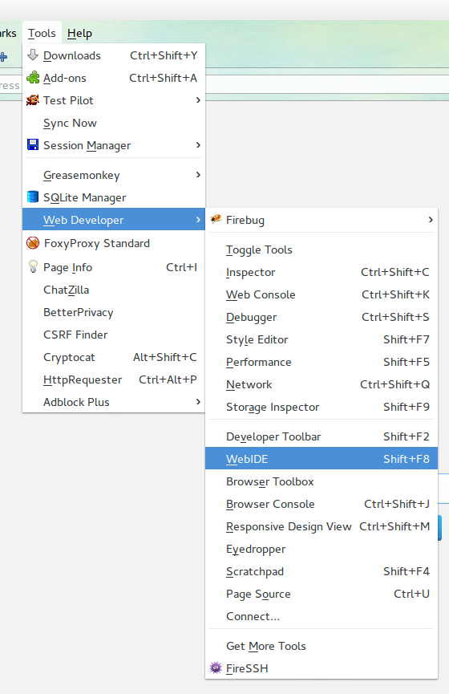
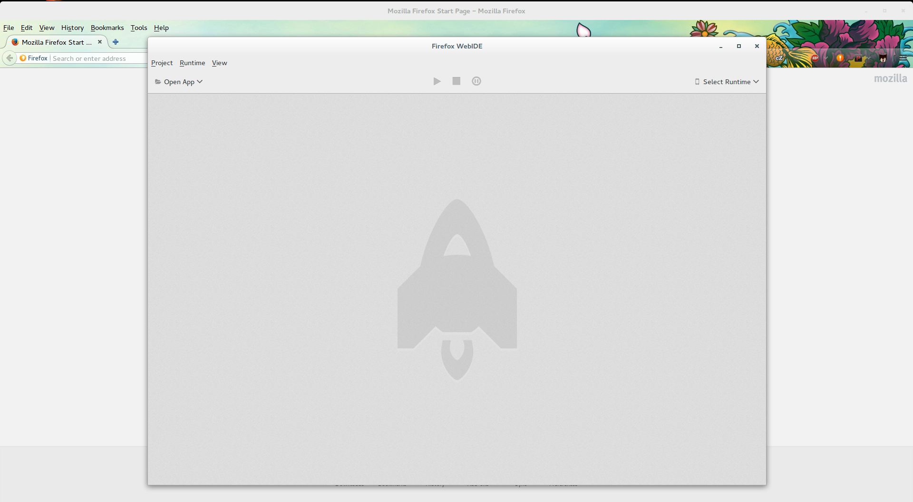
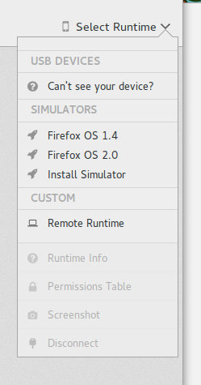
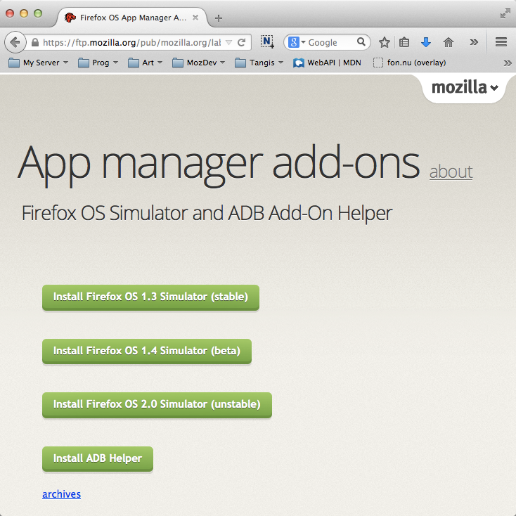

# Ambiente di sviluppo per Firefox OS {#setup}

## Il motore Gecko

I browser utilizzano diversi motori di rendering per mostrare le pagine web: Google Chrome e Opera utilizzano Blink (un fork di WebKit), Internet Explorer utilizza Trident, mentre Safari utilizza WebKit. Mozilla ha il suo motore, chiamato Gecko, che viene utilizzato da Firefox desktop, Firefox per Android e Firefox OS. Poiché questi prodotti usano lo stesso motore, è possibile sviluppare per Firefox OS utilizzando il browser Firefox desktop (con alcuni svantaggi[^engine]).

[^engine]: Nonostante i prodotti Mozilla utilizzino lo stesso motore di rendering, la versione di Gecko disponibile in Firefox OS è meno aggiornata rispetto a quella di Firefox desktop. Questo perché il ciclo di rilascio di Firefox OS è più lento rispetto a quello della versione Desktop. In pratica, questo vuol dire che alcune funzionalità non sono disponibili (o non funzionano come immaginato) quando si trasportano su Firefox OS - quindi è sempre importante verificare che la propria applicazione funzioni su un dispositivo Firefox OS. Inoltre, bisogna ricordarsi che gli utenti possono utilizzare versioni differenti di Firefox OS, quindi alcune potrebbero non avere tutte le funzionalità richieste. È importante fornire sempre un'alternativa in caso alcune di queste funzionalità non siano disponibili.

## Di che cosa abbiamo bisogno?

Per sviluppare e provare le applicazioni realizzate per Firefox OS abbiamo bisogno di:

 * Una versione recente di [Firefox desktop](http://getfirefox.com).
 * [Firefox OS Simulator](https://ftp.mozilla.org/pub/mozilla.org/labs/fxos-simulator/) (scegli la versione che vuoi installare. Anche tutte). 
 * (facoltativo) Un editor testuale per programmare[^editor].
 
[^editor]: esistono molti buoni editor con diversi livelli di complessità e caratteristiche. Un editor molto diffuso, che mi sento di consigliare a chi non ha ancora trovato il suo preferito, è [SublimeText](http://sublimetext.com/). Personalmente, io utilizzo [WebStorm](http://www.jetbrains.com/webstorm/) che è un IDE completo per la realizzazione di web app.
  
## Configurazione del WebIde

Se stai usando la versione attuale di Firefox (34 o successive) il WebIde è già integrato. WebIde da solo non basta, se non hai un disposititvo devi installare anche i simulatori per fare le prove. Mozilla ha una [documentazione completa a riguardo](https://developer.mozilla.org/it/Firefox_OS/usare_l_app_Manager) se vuoi approfondire l'argomento.  

WebIde può gestire più versioni di Firefox OS quindi puoi installare le versioni 1.3, 1.4 e 2.0 senza avere problemi di compatibilità, ricordati che più è alto il numero di versione e più tardi verrà rilasciata al pubblico.  

Adesso è il momento di vedere come funziona WebIde. Clicca su **Strumenti -> Web Developer -> WebIde**.

Dopo l'apertura dell'App Manager vedrai una schermata come questa.

La finestra è ancora vuota e noi adesso andiamo ad installare i simulatori sul computer.

Nella barra degli strumenti abbiamo il pulsante **Seleziona ...**, fai click per scegliere o installare una particolare versione del simulatore.

Fai clic su **Installa il simulatore** e seleziona la versione da installare facendo click sul bottone relativo. Hai finito!

## Ultimi ritocchi

Per fare debugging remoto il sistema deve riconoscere il dispositivo quindi sono necessari gli Android Tools o in parole povere `adb`. Come abbiamo accennato Firefox OS è basato su Android e quindi possiamo sfruttare alcuni dei suoi strumenti da sviluppatore come adb, che permette di passare dei file e di comunicare da computer a dispositivo e viceversa.  
Se adb non è presente nel computer, Firefox non potrà rilevare alcun dispositivo connesso!  
Con l'estensione [ADB Helper](https://ftp.mozilla.org/pub/mozilla.org/labs/fxos-simulator/) verrà installato su Firefox e si potrà debuggare da remoto con il proprio dispositivo Firefox OS. 

## Riassunto

In questo capitolo abbiamo scoperto che tutto ciò di cui abbiamo bisogno per sviluppare *app per Firefox OS* è il browser Firefox (in versione desktop) con l'estensione *Firefox OS Simulator* presente (e un buon editor di testo).

Ora che abbiamo configurato l'ambiente di sviluppo, siamo pronti per soffermarci su qualche concetto base prima di creare la nostra prima app.
