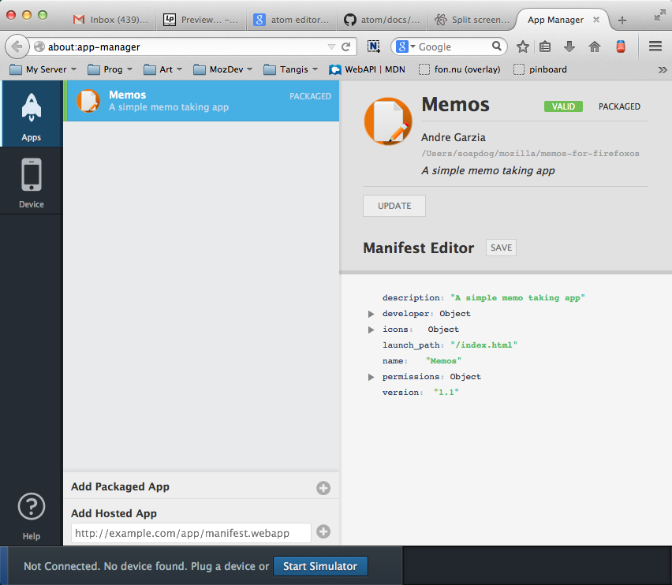
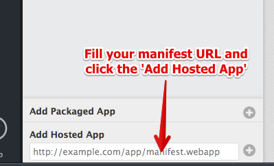
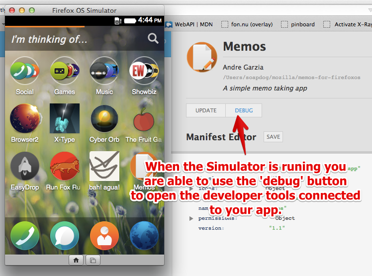
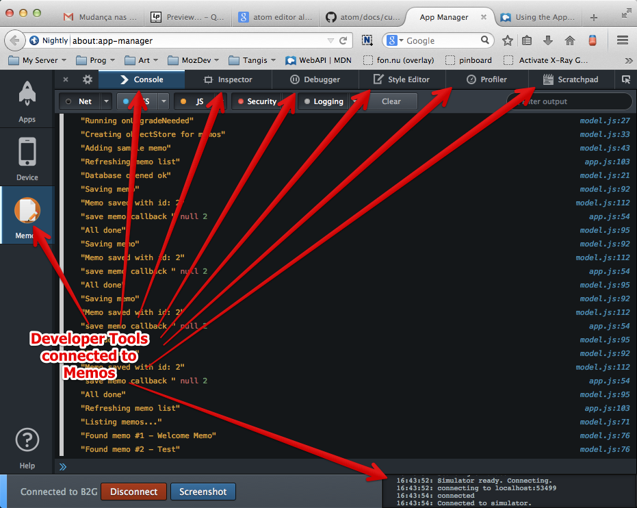
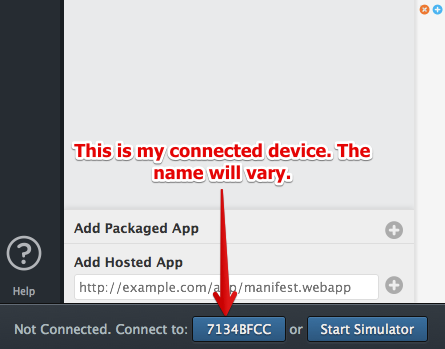

# App Manager {#app-manager}

Abbiamo scaricato il simulatore [nel capitolo precedente riguardo l'ambiente di lavoro](#setup) e l'abbiamo usato nel [capitolo riguardo la prima applicazione](#firstapp). Ora è tempo di dare un'occhiata più approfondita alle funzionalità dell'App Manager e le funzionalità base.

Per saperne di più, date un'occhiata [alla pagina Firefox OS: Usare l'App Manager][1] su MDN.

W> Ricordati: se stai usando un dispositivo Firefox OS 1.1 o ancora più vecchio devi usare il Simulatore 1.1 e non l'App Manager. Questo simulatore è spiegato nel prossimo capitolo.

## Aggiungere Applicazioni

Puoi aggiungere sia le applicazioni remota (hosted) e locale (packaged) all'App Manager. Vediamo come aggiungere ogni tipo di app:

### Aggiungere Applicazioni packaged 

Abbiamo già parlato di applicazioni packaged durante [la creazione della nostra prima applicazione](#firstapp), adesso è ora di provarla.

Per aggiungere una nuova applicazione packaged fare clic sul pulsante **Aggiungi app locale (packaged)** nella **Dashboard dell'App Manager** mostrato nella schermata sottostante.

Quando fai clic sul pulsante evidenziato nell'immagine, Firefox apre un picker per selezionare il file. Puoi navigare nel tuo hard disk e selezionare la **cartella che contiene il file manifest** dell'applicazione per aggiungerlo all' App Manager. Se non ci saranno problemi nel manifest l'applicazione sarà aggiunta all'elenco nella schermata.

### Aggiungere Applicazioni hosted

Se stai realizzando un'applicazione hosted dovrai provarla con un server web. Non provate il metodo descritto poco fà per le applicazioni hosted perchè ci sono degli errori che succedono solo in ambiente hosted come servire il manifest con il *MIME type* sbagliato. Nota che il simulatore non segnala errori riguardo il MIME type sbagliato, è importante controllare queste cose prima di caricare l'applicazione nel Mozilla Marketplace.

Molte delle applicazioni hosted non sono applicazioni realizzate specificatamente per Firefox OS ma si trattano di siti realizzati in modo responsive che si adattano alle risoluzioni dei dispositivi. Queste applicazioni web hanno un backend complesso che servono all'applicazione per funzionare e per questo è necessario provarla in un vero web server.

Avvia l'applicazione nel simulatore, inserisci la URL della tua applicazione nel campo di testo e fai clic sul pulsante **Aggiungi app remota (hosted)**.

Dopo aver fatto click sul pulsante, il manifest sarà verificato e se è corretto l'applicazione sarà aggiunta all'App Manager.

## Avviare l'applicazione

Avvia l'applicazione fai click sul pulsante **Avvia Simulatore** e successivamente verrà richiesto quale versione del Simulatore avviare.

Dopo aver avviato il simulatore fai clic sul pulsante **Aggiorna** che apparirà selezionando l'applicazione che verrà installata nel simulatore.

L'icona dell'applicazione apparirà nella schermata principale del Simulatore dopo la fine dell'installazione. Fai clic sull'icona per lanciarlo.

## Aggiornare l'applicazione

Ogni volta che si cambiano i file e si vuole provare nel simulatore le modifiche sarà necessario premere il pulsante **Aggiorna** che reinstallerà l'applicazione nel simulatore.

## Debug

Dopo che l'applicazione sarà aggiunta al simulatore avviato potremo fare il debug it facendo clic sul pulsante **Debug** nell'applicazione selezionata. Verrà aperta la **Console JavaScript** e connessa all'applicazione.

DOpo il clic su questo pulsante verrà aperta una schermata come questa:

COn gli strumenti connessi all'applicazione puoi provare il tuo codice JavaScript, fare il debug del DOM, modificare lo stile, ecc.

Una volta che l'applicazione è avviata sul simulatore è tempo di provare su un dispositivi reale.

## Provare le applicazioni su un dispositivo reale

Niente può sostituire le prove su un dispositivo reale. Sul simulatore, si possono provare le cose con il mouse cliccando sulla schermata de computer; mentre su un dispositivo reale si usano le proprieta su uno schermo ed i pulsanti fisici. C'è una grande differenza tra l'esperienza utente e di sviluppo.

Niente può sostituire il testing su un dispositivo reale. Nel simulatore i test vengono effettuati facendo clic con un mouse su uno schermo di computer, mentre con un dispositivo reale i test si effettuano toccando uno touchscreen e premendo con le dita dei pulsanti reali. Un'esperienza utente e sviluppatore completamente diversa.

Per sottolineare l'importanza di effettuare dei test su un dispositivo reale, racconterò un fatto personale. Alcuni anni fa Raphael Eckhardt  (il designer della copertina di questo testo) e io stavamo realizzando un puzzle game simile a  Bejeweled. Il nostro gioco consisteva nel trascinare e posizionare dei pezzi su una tavola e funzionava abbastanza bene sul simulatore. 

Quando abbiamo provato il gioco su un telefono reale ci siamo resi conto che i componenti del gioco non erano ottimizzati per la piattaforma *mobile*: quando posizionavamo la mano sullo schermo tutto scompariva dietro la mano. Inoltre i componenti di gioco erano troppo piccoli per le dita, quindi gli utenti non potevano rendersi conto di quello che stavano facendo, in poche parole l'interfaccia non era un granché. Il problema era che noi avevamo effettuato i nostri test utilizzando il mouse e il puntatore del mouse è molto piccolo. Quando abbiamo provato con le nostre dita "cicciotelle" ci siamo resi conto che dovevamo rielaborare l'interfaccia.  

Per evitare di avere un'esperienza così frustrante è indispensabile verificare sempre l'app su un dispositivo reale… O ancora meglio su qualunque dispositivo si abbia a disposizione. Effettuare dei buoni test su dei semplici prototipi è molto importante per non dover perdere tempo e denaro a rimodificare tutto ogni volta.

## Connettere un dispostivo Firefox OS

Se hai un dispositivo Firefox OS (con i driver necessari installati) puoi aggiungere le applicazioni direttamente nell'App Manager nel dispositivo se collegato computer. Quando l'App Manager rileva che hai collegato un dispositivo Firefox OS, verrà mostrato il codice del telefono in basso accanto al pulsante **Avvia Simulatore**.

Fai clic su questo pulsante per collegarlo, il telefono richiederà i permessi per stabilire una connessione di debug con l'App Manager, che dovranno essere confermati. Una volta che la connessione è effettuata sarà possibile usare i pulsanti **Aggiorna** e **Debug** nell'App Manager per aggiornare e fare il debug dell'applicazione sul dispositivo connesso come con il Simulatore.

## Riassunto

Per riassumere, l'App Manager è fantastico. Molto meglio rispetto alla vecchia estensione del Firefox OS 1.1 Simulator che adesso ha degli strumenti di sviluppo sono molto meglio e supportano più versioni di Firefox OS. Possiamo immaginare le future evoluzioni dell'App Manager con il suo editor integrato del manifest e molto altro.

Adesso hai la sensazione di potere e spero che da questo punto del libro hai una buona conoscenza del flusso di lavoro per la realizzazione di applicazioni Firefox OS.

Nel prossimo capitolo parleremo della vecchia versione del Simulatore di Firefox OS 1.1. Questo studio è necessario se si devono connettere dispositivi con Firefox OS 1.1. Il capitolo è molto simile a a questo. Attualmente è o stesso contenuto ma adattato per le differenti interfacce.

Dopo il capitolo sul simulatore parleremo della distribuzione della tua applicazione.

[1]: https://developer.mozilla.org/it/Firefox_OS/usare_l_app_Manager